# Redis

*基于Redis6做的笔记*

redis是一个nosql数据库 有很多应用场景
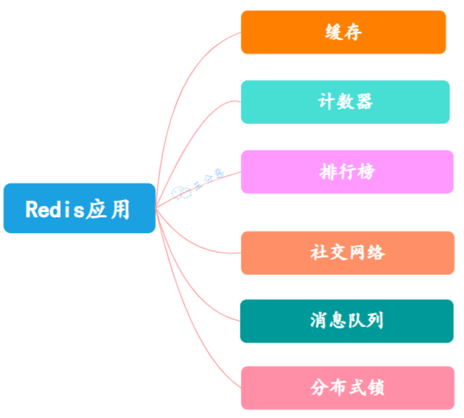

最主要的应用还是缓存
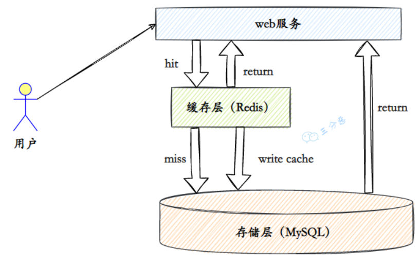


## 基础知识：

### 基础知识：

- `推荐在linux上使用redis` (windows上的redis也很少在维护了)
- redis默认端口6379
- `redis是单线程` 这点很重要 因为单线程所以决定了很多redis的特性
- Java 语言有三个官方推荐的实现：Jedis、Lettuce 和 Redission  推荐使用`Lettuce`
- `Redis默认有16个数据库`  这个可以在配置文件redis.conf中做出修改
- 安装redis就不在这里写了 (因为当时安装的时候没做笔记)
  启动redis：
  - 首先通过命令：`redies-server [配置文件]`    启动redis服务
  - 然后通过命令：`redis-cli -h [redis绑定的Ip] -p [redis的端口号]`   启动客户端连接到指定的服务
- C#整合redis的框架  ServiceStack.Redis

### 常用命令：

~~~bash
#切换数据库 对应的redis默认有16个数据库
select [数据库编号]

#清空当前数据库
flushdb

#清空所有数据库
flushall

#取所有key
keys *

#当前数据库键的总数
dbsize

#当前数据库是否存在指定值
EXISTS [keyName]

#重命名键
rename [oldKeyName] [newKeyName]

#删除键
del [keyName]

#查看键的类型
type [keyName]

#自增(如果value不是整数，则会报错)
incr [key] (指定大小默认1)

#自减(如果value不是整数，则会报错)
decr  [key] (指定大小默认1)

~~~

### 配置文件：


### 发布订阅：

Redis支持发布和订阅Pub/Sub 也可以实现消息队列Queue  但严格意义上不是消息中间件

Redis 客户端可以订阅任意数量的频道

~~~bash

~~~


## 数据类型：

### string：字符串

命令：

```bash

```

### list：列表

注意：
		list的底层数据结构是一个双向链表   所以它的命令是可以针对两边进行的

命令：

~~~bash
#将一个或者多个value插入到列表key的头部   key不存在则创建key
lpush [key] [value1] [value2]

#将value插入到列表key的头部   key不存在则不做任何处理
lpushx [key] [value1] [value2]

#将一个或者多个value插入到列表key的尾部   key不存在则创建key
rpush [key] [value1] [value2]

#将一个或者多个value插入到列表key的尾部    key不存在则不做任何处理
rpushx [key] [value]

#移除并返回key值的列表头元素
lpop [key]

#移除并返回key值的列表尾元素
rpop [key]

#返回key列表的长度
llen [key]

#返回key列表中下标为index的元素    头部从0开始   尾部从-1开始
lindex [key] [index]

#返回key列表中下标start(含)到stop(含)之间的元素
lrange [key] [start] [stop]

#将value设置到key列表中指定index位置    key不存在或者index超出范围则会报错
lset [key] [index] [value]

#截取列表中[start,end]之间的元素，并替换原列表保存
ltrim [key] [start] [end]
~~~

### set：集合

命令：

~~~bash

~~~


### hash：散列

命令：

~~~bash

~~~


### zset：有序集合

命令：

~~~bash

~~~

### Bitmap：位图

位图不是实际的数据类型  而是在String类型上定义的一组面向位的操作

### HyperLogLogs(HLL)：

属于一种概率算法  (LC,LLC,HLL)三种越来越节省内存  降低误差率

### Geospatial Indexes：地理空间索引

将制定的地理空间位置(经度、纬度、名称)添加到指定的key中
这些数据将会存储到Sorted set中
目的是为了方便GEORADIUS或者GEORADIUSBYMEMBER命令对数据进行半径查询等操作

### Streams：消息队列

Stream是Redis 5.0引入的一种新数据类型  是一个新的强大的支持多播的可持久化的消息队列


## 框架整合：

### Java客户端

redis支持的Java客户端有Redisson、Jedis、lettuce 等等
官方推荐使用 Redisson

### springboot整合：

#### 依赖：

~~~xml
<dependency>
    <groupId>org.springframework.boot</groupId>
    <artifactId>spring-boot-starter-data-redis</artifactId>
</dependency>
~~~

#### 自动装配类：

~~~java
@Configuration(proxyBeanMethods = false)
@ConditionalOnClass(RedisOperations.class)
@EnableConfigurationProperties(RedisProperties.class)
@Import({ LettuceConnectionConfiguration.class, JedisConnectionConfiguration.class })
public class RedisAutoConfiguration {
    @Bean
    @ConditionalOnMissingBean(name = "redisTemplate")
    @ConditionalOnSingleCandidate(RedisConnectionFactory.class)
    public RedisTemplate<Object, Object> redisTemplate(RedisConnectionFactory redisConnectionFactory) {
        RedisTemplate<Object, Object> template = new RedisTemplate<>();
        template.setConnectionFactory(redisConnectionFactory);
        return template;
    }

    @Bean
    @ConditionalOnMissingBean
    @ConditionalOnSingleCandidate(RedisConnectionFactory.class)
    public StringRedisTemplate stringRedisTemplate(RedisConnectionFactory redisConnectionFactory) {
        StringRedisTemplate template = new StringRedisTemplate();
        template.setConnectionFactory(redisConnectionFactory);
        return template;
    }

}
~~~

现在springboot`默认使用的是Lettuce` 当然也支持Jedis


## 缓存更新

在redis中  更新了数据库中的数据之后  需要更新缓存中的数据  而针对更新缓存也存在几种不同的更新策略

1. 先删缓存，再更新数据库
   假设有两个并发操作，一个操作更新、另一个操作查询   在更新完成之前  先查询了数据  还是会生成更新之前的缓存数据  `就会出现缓存脏读现象`
2. 先更新数据库，再删缓存
   **这是目前业界最常用的方案**  虽然也存在问题  但问题发生的概率很小
   在缓存删除后再次生成的过程中  数据库数据又被修改了  就可能会造成缓存脏读现象
   `不过这个情况出现的概率很小  多以业界还是常用`
3. 先更新数据库，再更新缓存
   这种情况是会有更高的读性能  应为不需要重新生成缓存
   但显然写性能会降低   关键是这种策略也会出现缓存脏读的现象
4. read/write through 缓存代理
   这种模式 不同于上面的三种  这种模式是屏蔽了数据库的操作  直接对缓存进行操作
   应用程序只需要对缓存进行操作  剩下的都交给缓存去处理
5. 写回
   在更新数据的时候  只更新缓存  不更新数据库
   而我们的缓存会异步地批量更新数据库

## 事务和锁：

### 事务：

#### 事务特性：

本质：`redis的事务本质上是一组命令的集合`

redis的事务都会被序列化  `按照顺序执行 事务执行中不会被事务外的命令插入打扰执行`

`redis单条命令保证原子性  事务不保证原子性`  所以事务执行中  错误的命令会单独抛出错误  而不会回滚整个事务

redis中不存在隔离级别

#### 事务流程：

1. 开启事务 multi
2. 命令入队
3. 执行事务 exec
4. 取消事务 discard
5. 监视Key WATCH
6. 放弃监视 UNWATCH

在redis的事务中 
`编译型错误是会导致整个事务停止的 (语句写错了 直接就不能执行的语句 会导致编译型错误)`
`运行时错误不会影响整个事务只会造成单条命令报错 （运行时错误如 对字符串做加一  命令本身符合规范的）`

#### SpringBoot实现：

~~~java
// 开启事务支持 (默认是不开启的 会认为每一次都是新的连接 所以失效)
stringRedisTemplate.setEnableTransactionSupport(true);
// 开启事务
stringRedisTemplate.multi();
stringRedisTemplate.opsForValue().set("name", "qinyi");
stringRedisTemplate.opsForValue().set("gender", "male");
stringRedisTemplate.opsForValue().set("age", "19");
System.out.println(stringRedisTemplate.exec()); 
~~~

SessionCallback：

~~~java
// 通过sessionCallback实现
SessionCallback<Object> callback = new SessionCallback<Object>() {
    @Override
    public Object execute(RedisOperations operations) throws DataAccessException {
        operations.multi();
        operations.opsForValue().set("name", "qinyi");
        operations.opsForValue().set("gender", "male");
        operations.opsForValue().set("age", "19");
        return operations.exec();
    }
};
// 执行
System.out.println(stringRedisTemplate.execute(callback));
~~~


### 锁：

#### 乐观锁：

redis中的乐观锁就是通过监视命令实现的
在redis的事务执行前  我们对需要上锁的数据加上监视
那么在后面事务执行的时候 一旦发现被监视的数据 值被事务外的命令修改了  那么整个事务都不会提交事务会返回nil

使用了监视命令之后的事务  执行过程应该是
1-先组织事务命令队列
2-执行事务之前 检查被监视的key是否有被修改  有被修改那么事务执行失败  直接返回nil
3-如果检查监视的key没有发生修改 就直接执行事务命令

~~~bash
#监视Key改变  用于实现乐观锁
WATCH [key]

#放弃监视
UNWATCH [key]
~~~

#### 悲观锁：


#### 秒杀案例：


## 数据持久化：

需要注意的是RDB默认开启  AOF默认不开启
两种方式的持久化是可以同时存在的  但是当Redis重启时  AOF文件会被优先用于重建数据

### RDB：

#### 概述：

RDB是根据指定的配置 定期将redis的数据写到硬盘中 实际就是生成数据库快照
默认写入的文件名是`dump.rdb` 默认生成的位置是启动redis服务的文件夹 RDB默认是打开的
文件生成的位置和名字是可以在配置文件中修改的

#### 原理：

> 1. Redis调用fork()  产生一个子进程
> 2. 子进程把数据写到一个临时的RDB文件
> 3. 当子进程写完新的RDB文件后  把旧的RDB文件替换掉

#### 保存：

~~~bash
# redis默认的三个保存策略
# 格式为：save <seconds> <changes>
# 可以设置多个
save 900 1 #900秒后至少1个key有变动
save 300 10 #300秒后至少10个key有变动
save 60 10000 #60秒后至少10000个key有变动

# 如果想禁用快照保存的功能的话  可以注释掉所有的save策略 或者直接在最后添加下面的命令
save ""
~~~

- 手动触发同步
  - **save**：save命令会阻塞当前Redis服务 直到 RDB 备份过程完成  在这个时间内  客户端的所有查询都会被阻塞
  - **bgsave**：Redis进程会 fork 出一个子进程 阻塞只会发生在 fork 阶段  之后持久化的操作则由子进程来完成
- 自动触发同步
  - 如果从节点执行全量复制操作  则主节点自动执行`bgsave`并将生成的 RDB 文件发送给从节点  主从同步
  - 执行`debug reload`命令重新加载Redis时  会触发`save`操作
  - 执行`shutdown`命令时候  如果没有启用 AOF 持久化则默认采用`bgsave`进行持久化

#### 优势：

- RDB文件是一个很简洁的单文件，它保存了某个时间点的Redis数据，很适合用于做备份。你可以设定一个时间点对RDB文件进行归档，这样就能在需要的时候很轻易的把数据恢复到不同的版本。
- 基于上面所描述的特性，RDB很适合用于灾备。单文件很方便就能传输到远程的服务器上。
- RDB的性能很好，需要进行持久化时，主进程会fork一个子进程出来，然后把持久化的工作交给子进程，自己不会有相关的I/O操作。
- 比起AOF，在数据量比较大的情况下，RDB的启动速度更快。

#### 劣势：

- 因为RDB的工作原理是先在一个临时文件上备份 所以`rdb持久化可能需要两倍的磁盘空间` 对于磁盘空间有所浪费

- RDB容易造成数据的丢失。假设每5分钟保存一次快照，如果Redis因为某些原因不能正常工作，那么从上次产生快照到Redis出现问题这段时间的数据就会丢失了。
- RDB使用`fork()`产生子进程进行数据的持久化，如果数据比较大的话可能就会花费点时间，造成Redis停止服务几毫秒。如果数据量很大且CPU性能不是很好的时候，停止服务的时间甚至会到1秒。

#### 错误：

默认情况下，如果Redis在后台生成快照的时候失败，那么就会停止接收数据，目的是让用户能知道数据没有持久化成功。但是如果你有其他的方式可以监控到Redis及其持久化的状态，那么可以把这个功能禁止掉。

~~~bash
stop-writes-on-bgsave-error yes
~~~

#### 压缩：

Redis 默认采用LZF算法对生成的RDB文件做压缩处理 
这样可以减少占用空间和网络传输的数据量 但是压缩过程会耗费 CPU 的计算资源 
你可以按照实际情况 选择是否启用
可以通过修改 `redis.conf` 中的 `rdbcompression` 配置或使用以下命令来进行动态修改：

~~~bash
config set rdbcompression {yes|no}
~~~


### AOF：

#### 概述：

AOF是以日志的形式来进行持久化的  AOF是会保存redis中所有的写操作(增删改)  通过追加式文件实现持久化
默认写入的文件名是`apendonly.aof` 默认生成的位置是启动redis服务的文件夹 AOF默认是关闭的
文件名和启动也都是在配置文件中修改的

#### 配置：

```bash
# 启用AOF
appendonly yes

# 文件存放目录，与RDB共用。默认为当前工作目录。
dir ./

# 默认文件名为appendonly.aof
appendfilename "appendonly.aof"

# Redis会记住自从上一次重写后AOF文件的大小（如果自Redis启动后还没重写过，则记住启动时使用的AOF文件的大小）。
# 如果当前的文件大小比起记住的那个大小超过指定的百分比，则会触发重写。
# 同时需要设置一个文件大小最小值，只有大于这个值文件才会重写，以防文件很小，但是已经达到百分比的情况。
# 要禁用自动的日志重写功能，我们可以把百分比设置为0：
auto-aof-rewrite-percentage 100 #百分比
auto-aof-rewrite-min-size 64mb #文件大小最小值
```

#### 保存：

你可以配置Redis调用fsync的频率，有三个选项：

- 每当有新命令追加到AOF的时候调用fsync。速度最慢，但是最安全。
- 每秒fsync一次。速度快（2.4版本跟快照方式速度差不多），安全性不错（最多丢失1秒的数据）。
- 从不fsync，交由系统去处理。这个方式速度最快，但是安全性一般。

推荐使用每秒fsync一次的方式（默认的方式），因为它速度快，安全性也不错。相关配置如下：

```bash
# appendfsync always
appendfsync everysec
# appendfsync no
```

#### 原理：

日志重写：AOF会记录所有的操作  但是对于数据恢复而言 只需要一条最终数据结果的命令 所以有日志重写这个功能  下面就是日志重写的原理

> 1. Redis调用fork()   产生一个子进程
> 2. 子进程把新的AOF写到一个临时文件里
> 3. 主进程持续把新的变动写到内存里的buffer  同时也会把这些新的变动写到旧的AOF里  这样即使重写失败也能保证数据的安全
> 4. 当子进程完成文件的重写后  主进程会获得一个信号  然后把内存里的buffer追加到子进程生成的那个新AOF里

#### 优势：

- 比RDB可靠。你可以制定不同的fsync策略：不进行fsync、每秒fsync一次和每次查询进行fsync。默认是每秒fsync一次。这意味着你最多丢失一秒钟的数据。
- AOF日志文件是一个纯追加的文件。就算是遇到突然停电的情况，也不会出现日志的定位或者损坏问题。甚至如果因为某些原因（例如磁盘满了）命令只写了一半到日志文件里，我们也可以用`redis-check-aof`这个工具很简单的进行修复。
- 当AOF文件太大时，Redis会自动在后台进行重写。重写很安全，因为重写是在一个新的文件上进行，同时Redis会继续往旧的文件追加数据。新文件上会写入能重建当前数据集的最小操作命令的集合。当新文件重写完，Redis会把新旧文件进行切换，然后开始把数据写到新文件上。
- AOF把操作命令以简单易懂的格式一条接一条的保存在文件里，很容易导出来用于恢复数据。例如我们不小心用`FLUSHALL`命令把所有数据刷掉了，只要文件没有被重写，我们可以把服务停掉，把最后那条命令删掉，然后重启服务，这样就能把被刷掉的数据恢复回来。

#### 劣势：

- 在相同的数据集下  AOF文件的大小一般会比RDB文件大  RDB在恢复大数据集时速度比AOF的恢复速度快
- 在某些fsync策略下  AOF的速度会比RDB慢
  通常fsync设置为每秒一次就能获得比较高的性能  而在禁止fsync的情况下速度可以达到RDB的水平


### 从RDB切换到AOF：

- 备份一个最新的`dump.rdb`的文件  并把备份文件放在一个安全的地方

- 运行以下两条命令：

  ```
  $ redis-cli config set appendonly yes
  $ redis-cli config set save ""
  ```

- 确保数据跟切换前一致

- 确保数据正确的写到AOF文件里

> 第二条命令是用来禁用RDB的持久化方式  但是这不是必须的  因为你可以同时启用两种持久化方式
>
> 记得对配置文件`redis.conf`进行编辑启用AOF

### 建议的备份方法：

> - 创建一个定时任务，每小时和每天创建一个快照，保存在不同的文件夹里。
> - 定时任务运行时，把太旧的文件进行删除。例如只保留48小时的按小时创建的快照和一到两个月的按天创建的快照。
> - 每天确保一次把快照文件传输到数据中心外的地方进行保存，至少不能保存在Redis服务所在的服务器。

## 主从关系：

redis中可以存在主从关系：

- 一个主服务器  多个从服务器  `redis主从关系主要是为了实现读写分离` 主服务器负责写操作 从服务器负责读操作

  读写分离 是为了解决redis单体性能的上限 读写分离可以比较方便的解决大量读操作 (只需要通过增加从服务器就可以提升服务器整体的读操作性能上限)

  而在写操作的访问数量级上升到单体主服务器无法承受的时候 就需要sharding方案来处理 redis和mysql的集群都是官方提供的sharding方案
  PS：上面的部分内容部分可以参考 程序设计.md 文件

- 在Redis中一个服务器只能有一个主服务器 (不过可以有多级关系 也就是'薪火相传'机制的原理)

- 复制延迟：因为主从关系的读写分离 所以在主服务器上写入数据后 需要同步到从服务器上  而这段时间内的复制 会有一定的延迟 当系统繁忙的时候 延迟的问题会更加严重 从服务器的数量增加会使这个问题更加严重(多级从属也是一样)

### 复制原理：

redis的主从复制步骤是：

1. 在从属服务器中通过命令设置主服务器的Ip端口信息 
2. 设置目标主服务器的信息后 从属服务器会向主服务器发送同步请求
3. 主服务器在接收到请求后 会将自身的数据通过RDB持久化的形式存储到磁盘中(也就是写到RDB文件中)
4. 然后向从属服务器发送RDB文件  从属服务器再通过RDB文件实现数据同步
5. 在从服务器和主服务器连接后  从服务器不会再向主服务器主动发起同步请求
6. 在后面 主服务器中收到写操作后 会同步到从服务器 (在第一次同步命令执行之后 所有的同步命令都是通过主服务器发出的)

### 关系设置：

~~~bash
#查看当前服务器的主从关系
info replication

#设置主从关系
slaveof  [host] [port]
~~~

### 多级服务：

所谓的多级服务 其实多级从服务器
实现数据的多级同步 缓解了主服务向所有从服务器同步数据的压力

### 主从切换：

主从切换就是redis在主服务器意外停止后 通过命令使主从服务器实现切换
 在从服务器执行主从切换命令 从服务器就切换为主服务器

~~~bash
#断开主从关系
slaveof no one
~~~

### 哨兵模式：

需要注意的是 上面说的主从切换 是需要手动切换的
`哨兵模式简单的说就是主从切换的自动化模式` 通过一个哨兵去监控服务器
不过哨兵模式并不仅仅只是一个自动化的主从切换机制：

- 在哨兵模式下主服务器挂掉下线后  `再次启动后哨兵会向原主服务器发出slaveof命令 作为从服务器挂到新的主服务器上`
- 哨兵模式下的主从切换 也是存在规则的 选择条件依次为
  - 选择优先级考前的：优先级是在配置文件中配置的  slave-priority 100 值越小优先级越高
  - 选择偏移量最大的：偏移量是指获得原主机数据最全的
  - 选择RunID最小的：RunID是redis启动后随机生成的一个40位的runid
- 哨兵监控到主服务器挂掉 然后进行主从切换 这期间是存在一个时间差的 并不是瞬时无缝完成的

~~~bash
# 哨兵模式配置文件 sentinel.conf 文件
sentinel monitor [主服务器别名] [host 主服务器IP地址] [哨兵同意数]
~~~

##### 哨兵模式工作原理：

1. 每个 Sentinel（哨兵）进程以每秒钟一次的频率向整个集群中的 Master 主服务器，Slave 从服务器以及其他 Sentinel（哨兵）进程发送一个 PING 命令。
2. 如果一个实例（instance）距离最后一次有效回复 PING 命令的时间超过 down-after-milliseconds 选项所指定的值， 则这个实例会被 Sentinel（哨兵）进程标记为主观下线（SDOWN）
3. 如果一个 Master 主服务器被标记为主观下线（SDOWN），则正在监视这个 Master 主服务器的所有 Sentinel（哨兵）进程要以每秒一次的频率确认 Master 主服务器的确进入了主观下线状态
4. 当有足够数量的 Sentinel（哨兵）进程（大于等于配置文件指定的值）在指定的时间范围内确认 Master 主服务器进入了主观下线状态（SDOWN）， 则 Master 主服务器会被标记为客观下线（ODOWN）
5. 在一般情况下， 每个 Sentinel（哨兵）进程会以每 10 秒一次的频率向集群中的所有 Master 主服务器、Slave 从服务器发送 INFO 命令。
6. 当 Master 主服务器被 Sentinel（哨兵）进程标记为客观下线（ODOWN）时，Sentinel（哨兵）进程向下线的 Master 主服务器的所有 Slave 从服务器发送 INFO 命令的频率会从 10 秒一次改为每秒一次。
7. 若没有足够数量的 Sentinel（哨兵）进程同意 Master 主服务器下线， Master 主服务器的客观下线状态就会被移除。若 Master 主服务器重新向 Sentinel（哨兵）进程发送 PING 命令返回有效回复，Master 主服务器的主观下线状态就会被移除。

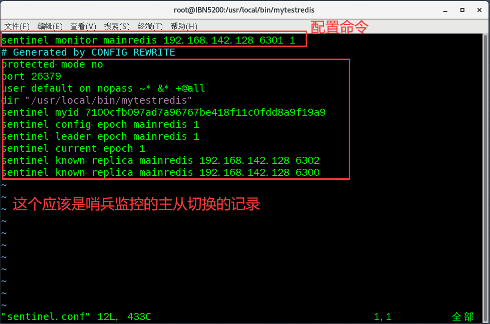


## Redis集群：

### 集群搭建：

#### 搭建操作

配置多个redis服务器的配置文件

1. 在配置文件中对redis的集群模式进行配置：

~~~bash
# 启动集群模式
cluster-enabled yes

# 文件要和端口号对应
cluster-config-file nodes9001.conf

# 连接超时时长
cluster-node-timeout 15000
~~~

2. 使用配置好的配置文件启动服务器 （到这一步只是做好了集群的配置 真正的创建集群还是在下一步）
3. 创建集群需要使用到ruby命令  所以需要安装ruby的环境  高版本的redis自带了ruby的环境 不需要安装
4. ruby命令如下：

~~~ruby
# 使用redis的根目录下的src文件夹执行 使用src中的redis-cli来执行创建
redis-cli -cluster create -cluster -replicas 1 [redis服务器IP地址]:[端口] [redis服务器IP地址]:[端口]
~~~

#### 搭建流程

大致流程
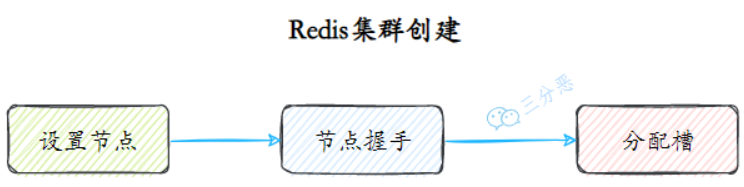

1. 设置节点：节点数量至少为6个才能保证组成完整高可用的集群
   每个节点需要开启配置cluster-enabled yes

2. 节点握手：集群模式下的节点要通过Gossip协议彼此通信
   由客户端发起命令cluster meet {ip} {port}
   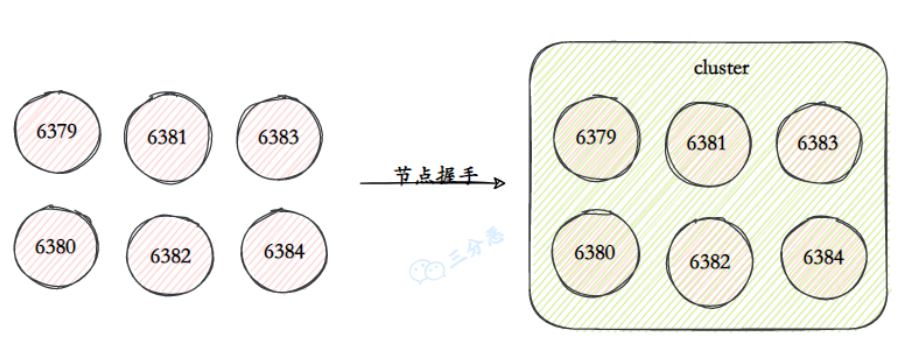

3. 设置主从：

   ~~~bash
   redis-cli -h 47.98.147.49 -p 6395  CLUSTER REPLICATE   0affa79edef47e10a0459832d279fe74467be98b
   
   redis-cli -h 47.98.147.49 -p 6396  CLUSTER REPLICATE   1e30c186681638411f25f949f1b6ffded5f5d0a3
   ~~~

4. 分配槽：通过 cluster addslots命令为节点分配槽
   批量分配槽如：

   ~~~bash
   redis-cli -h 47.98.147.49  -p 6391  cluster addslots {0..5461}
   redis-cli -h 47.98.147.49  -p 6392 cluster   addslots {5462..10922}
   redis-cli -h 47.98.147.49  -p  6393 cluster addslots {10923..16383}
   ~~~

   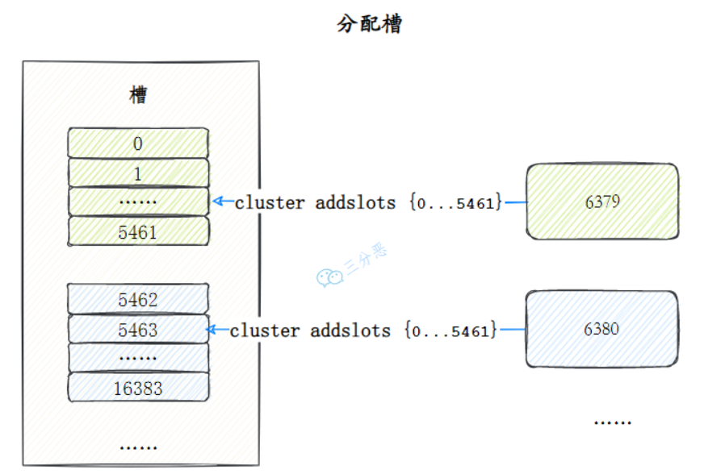


### 集群缺点：

1. `键的批量操作支持有限，比如mset, mget，如果多个键映射在不同的槽，就不支持了`
2. `键事务支持有限，当多个key分布在不同节点时无法使用事务，同一节点是支持事务`
3. 键是数据分区的最小粒度，不能将一个很大的键值对映射到不同的节点
4. `不支持多库  只有0库  select 0`
5. 复制结构只支持单层结构  不支持树型结构

#### 集群通讯：

服务器节点之间采用Gossip协议进行通信  Gossip协议就是指服务器节点彼此之间不断通信交换信息

当主从角色变化或新增节点  彼此通过ping/pong进行通信知道全部节点的最新状态并达到集群同步

##### Gossip协议：

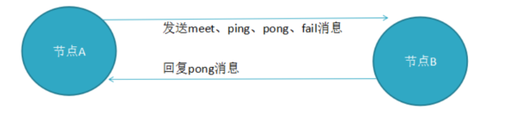

> `Gossip协议的主要职责就是信息交换，信息交换的载体就是节点之间彼此发送的Gossip消息，常用的Gossip消息有ping消息、pong消息、meet消息、fail消息`
>
> meet消息：用于通知新节点加入，消息发送者通知接收者加入到当前集群，meet消息通信完后，接收节点会加入到集群中，并进行周期性ping pong交换；
>
> ping消息：集群内交换最频繁的消息，集群内每个节点每秒向其它节点发ping消息，用于检测节点是在在线和状态信息，ping消息发送封装自身节点和其他节点的状态数据；
>
> pong消息，当接收到ping meet消息时，作为响应消息返回给发送方，用来确认正常通信，pong消息也封闭了自身状态数据；
>
> fail消息：当节点判定集群内的另一节点下线时，会向集群内广播一个fail消息；

### 分布问题：

#### 插槽：

redis通过插槽(slot)来解决分布问题 redis有16384个插槽 这些插槽均匀的分布在多个写服务器上

~~~bash
# redis根据这个公式来 计算key属于那个一个插槽 然后根据插槽来匹配分区 最后redis会去相应的节点进行操作
HASH_SLOT=CRC16(key) mod 16384
~~~

##### 为什么插槽数量是16384 ？

`CRC16`算法产生的hash值有16bit  该算法可以产生2^16-=65536个值  为什么插槽数量是16384 

1. 如果槽位为65536  发送心跳信息的消息头达8k  发送的心跳包过于庞大
2. redis的集群主节点数量基本不可能超过1000个
3. 槽位越小  节点少的情况下  压缩比高

##### 为什么要用插槽？

解耦数据与服务器关系  服务器自身维护与插槽的映射关系  分布式存储

#### 查询：

基于上面的分布问题 我们可以知道redis中的数据都是根据插槽存到了不同的服务器上 那么我们要根据key来查询数据的话  按照常规的做法是使用代理方案 用一个代理来接收所有读请求然后转发  但是这个做法很容易就到达代理服务器的访问上限

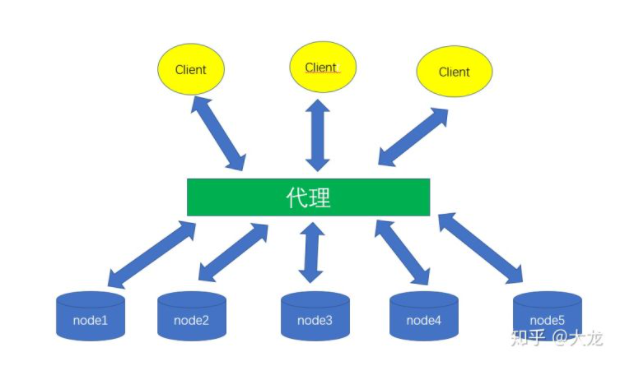

Redis没有选择使用代理  而是客户端直接连接每个节点
Redis的每个节点中都存储着如下所示的整个集群的状态  集群状态中一个重要的信息就是每个服务器的负责插槽
在具体的实现中  Redis用一个大小固定为CLUSTER_SLOTS的clusterNode数组 slots来保存每个服务器的负责插槽

1. 在集群模式下  Redis接收任何键相关命令时首先计算键对应的插槽
2. 再根据插槽找出所对应的服务器 如果服务器是自身  则处理键命令
   否则回复MOVED重定向错误  通知客户端请求正确的节点  这个过程称为MOVED重定向
3. 重定向信息包含了键所对应的插槽以及负责该插槽的服务器地址  根据这些信息客户端就可以向正确的服务器发起请求

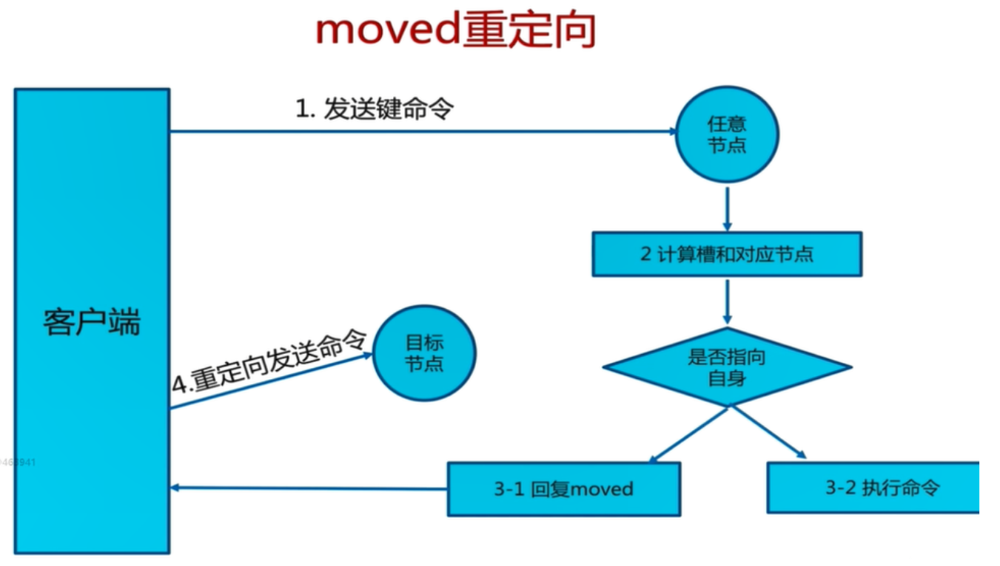

### 扩容缩容：

##### 集群伸缩：

集群的伸缩包括新节点的加入和旧节点退出：

- 新节点加入 我们需要把一部分数据迁移到新节点来达到集群的负载均衡
- 旧节点退出 我们需要把其上的数据迁移到其他节点上 确保该节点上的数据能够被正常访问

集群伸缩的核心其实是数据的迁移
在Redis集群中 数据是以slot为单位的 所以 `Redis集群的伸缩本质上是slot在不同机器节点间的迁移`

需要说明的是 `Redis集群并没有一个自动实现负载均衡的工具` 把多少slots从哪个节点迁移到哪个节点完全是由用户自己来指定的

### 高可用问题：

当集群里某个节点出现了问题，redis集群内的节点通过ping pong消息发现节点是否健康，是否有故障，其实主要环节也包括了 主观下线和客观下线以及故障恢复；

- 主观下线：`指某个节点认为另一个节点不可用`，即下线状态，当然这个状态不是最终的故障判定，只能代表这个节点自身的意见，也有可能存在误判；

  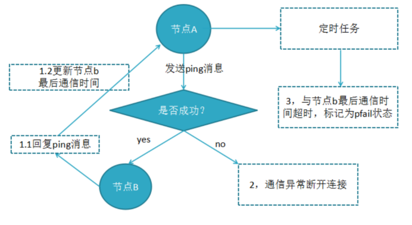

- 客观下线：指真正的下线，`集群内多个节点都认为该节点不可用`，达成共识，将它下线，如果下线的节点为主节点，还要对它进行故障转移；

  假如节点a标记节点b为主观下线，一段时间后节点a通过消息把节点b的状态发到其它节点，当节点c接受到消息并解析出消息体时，会发现节点b的pfail状态时，会触发客观下线流程；

  当下线为主节点时，此时redis集群为统计持有槽的主节点投票数是否达到一半，当下线报告统计数大于一半时，被标记为客观下线状态。

  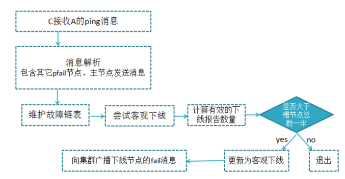

- 故障恢复：故障主节点下线后，如果下线节点的是主节点，则需要在它的从节点中选一个替换它，保证集群的高可用；
  转移过程如下：

  - 资格检查：检查该从节点是否有资格替换故障主节点，如果此从节点与主节点断开过通信，那么当前从节点不具体故障转移；
  - 准备选举时间：当从节点符合故障转移资格后，更新触发故障选举时间，只有到达该时间后才能执行后续流程；
  - 发起选举：当到达故障选举时间时，进行选举；
  - 选举投票：只有持有槽的主节点才有票，会处理故障选举消息，投票过程其实是一个领导者选举（选举从节点为领导者）的过程，每个主节点只能投一张票给从节点，当从节点收集到足够的选票（大于N/2+1）后，触发替换主节点操作，撤销原故障主节点的槽，委派给自己，并广播自己的委派消息，通知集群内所有节点。

  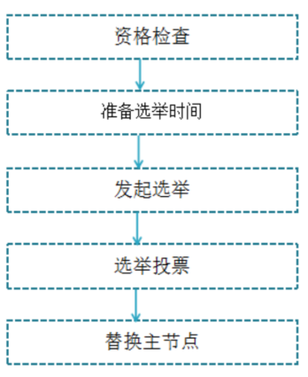


## 应用问题：

### 缓存穿透：

#### 现象：

缓存穿透是指缓存和数据库中都没有的数据  而用户不断发起请求  这时候这个用户就相当于攻击者
攻击会导致数据库压力过大  严重会击垮数据库

比如 如果你的id都是正整数 而用户一直用-1来进行请求  高并发点可能就会击垮数据库

本质是：`用户请求的数据redis中不存在 库中也不存在 (redis中不存在会直接去库中请求) 高并发的情况下 就会崩溃`

#### 解决：

- 在接口层增加校验 比如用户鉴权校验、参数校验
- 在从redis和数据库中都没取到数据的时候  可以把对应的key写入null
- 在网关层 对单个IP每秒访问次数超出阈值的IP都拉黑
- Redis还有一个高级用法`布隆过滤器（Bloom Filter）` 就是利用高效的数据结构和算法快速判断出你这个Key是否在数据库中存在


### 缓存击穿：

#### 现象：

缓存击穿和缓存雪崩很像  但是缓存击穿是指  一个承受高并发的缓存过期了 这个时候作用于这个热点数据上的访问都会直接作用于数据库 库很可能就会被瞬间击穿

#### 解决：

- 设置热点数据永远不过期
- 或者对热点数据 加上互斥锁


### 缓存雪崩：

#### 现象：

大量的缓存在同一时间点失效  数据请求直接作用于数据库本身了 数据库挂掉

同一时间大面积失效，那一瞬间Redis跟没有一样，那这个数量级别的请求直接打到数据库几乎是灾难性的，你想想如果打挂的是一个用户服务的库，那其他依赖他的库所有的接口几乎都会报错，如果没做熔断等策略基本上就是瞬间挂一片的节奏

#### 解决：

- 在批量往Redis存数据的时候  把每个Key的失效时间都加个随机值就好了  这样可以保证数据不会在同一时间大面积失效

- 或者设置热点数据永远不过期  有更新操作就更新缓存就好了


## 原理

### 启动流程

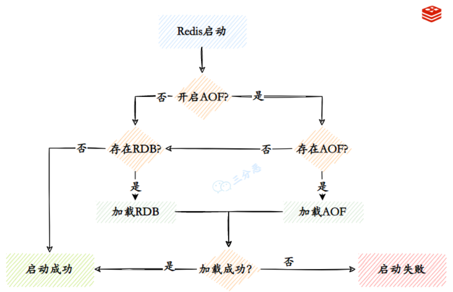


## 面试题


### 概念

#### 优缺点

> 优点
>
> - **读写性能优异**， Redis能读的速度是110000次/s，写的速度是81000次/s。
> - **支持数据持久化**，支持AOF和RDB两种持久化方式。
> - **支持事务**，Redis的所有操作都是原子性的，同时Redis还支持对几个操作合并后的原子性执行。
> - 数据结构丰富，除了支持string类型的value外还支持hash、set、zset、list等数据结构。
> - **支持主从复制**，主机会自动将数据同步到从机，可以进行读写分离。
>
> 缺点
>
> - 数据库容量**受到物理内存的限制**，不能用作海量数据的高性能读写，因此Redis适合的场景主要局限在较小数据量的高性能操作和运算上。
> - Redis 不具备自动容错和恢复功能，主机从机的宕机都会导致前端部分读写请求失败，需要等待机器重启或者手动切换前端的IP才能恢复。
> - 主机宕机，宕机前有部分数据未能及时同步到从机，切换IP后还会引入数据不一致的问题，降低了系统的可用性。
> - Redis **较难支持在线扩容**，在集群容量达到上限时在线扩容会变得很复杂。为避免这一问题，运维人员在系统上线时必须确保有足够的空间，这对资源造成了很大的浪费。

#### Redis为什么这么快

> - 完全**基于内存**，绝大部分请求是纯粹的内存操作，非常快速。数据存在内存中，类似于 HashMap，HashMap 的优势就是查找和操作的时间复杂度都是O(1)；
> - **数据结构简单**，对数据操作也简单，Redis 中的数据结构是专门进行设计的；
> - 采用**单线程**，避免了不必要的上下文切换和竞争条件，也不存在多进程或者多线程导致的切换而消耗 CPU，不用去考虑各种锁的问题，不存在加锁释放锁操作，没有因为可能出现死锁而导致的性能消耗；
> - 使用**多路 I/O 复用模型**，非阻塞 IO；
> - 使用底层模型不同，它们之间底层实现方式以及与客户端之间通信的应用协议不一样，Redis 直接自己构建了 VM 机制 ，因为一般的系统调用系统函数的话，会浪费一定的时间去移动和请求；

#### 数据类型

>  Redis主要有5种数据类型 包括String、List、Set、Zset、Hash满足大部分的使用要求

#### 多命令

> 管道：客户端可以通过管道将命令批量打包发送到redis
> 事务：客户端可通过事务将命令批量发送到redis
> lua脚本：lua脚本也可以达到一样的效果


### 持久化

Redis 提供两种持久化机制 RDB（默认） 和 AOF 机制
推荐两种持久化方式同时使用

#### RDB

> RDB是Redis默认的持久化方式
> 按照一定的时间将内存的数据以快照的形式保存到硬盘中 dump.rdb
>
> 优点很多
>
> - 只有一个文件 dump.rdb 方便持久化
>
> - 容灾性好 一个文件可以保存到安全的磁盘
>
> - 性能最大化，fork 子进程来完成写操作，让主进程继续处理命令，所以是 IO 最大化。
>   使用单独子进程来进行持久化，主进程不会进行任何 IO 操作，保证了 redis 的高性能
>
> - 相对于数据集大时，比 AOF 的启动效率更高
>
> 但是缺点很明显 因为是隔一段时间保存 所以可能发生数据丢失

#### AOF

> 是将Redis执行的写命令都记录到单独的日志文件中
> 当重启Redis会重新将持久化的日志中文件恢复数据
>
> 当两种方式同时开启时 数据恢复Redis会优先选择AOF恢复
>
> 优点
>
> - 数据安全，aof 持久化可以配置 appendfsync 属性，有 always，每进行一次 命令操作就记录到 aof 文件中一次。
> - 通过 append 模式写文件，即使中途服务器宕机，可以通过 redis-check-aof 工具解决数据一致性问题。
> - AOF 机制的 rewrite 模式。AOF 文件没被 rewrite 之前（文件过大时会对命令 进行合并重写），可以删除其中的某些命令（比如误操作的 flushall）)
>
> 缺点：
>
> - AOF 文件比 RDB 文件大，且恢复速度慢。
>
> - 数据集大的时候，比 rdb 启动效率低。

#### 过期策略

> - 定时过期：每个设置过期时间的key都需要创建一个定时器，到过期时间就会立即清除。
>   该策略可以立即清除过期的数据，对内存很友好；
>   但是会占用大量的CPU资源去处理过期的数据，从而影响缓存的响应时间和吞吐量。
> - 惰性过期：只有当访问一个key时，才会判断该key是否已过期，过期则清除。
>   该策略可以最大化地节省CPU资源，却对内存非常不友好。
>   极端情况可能出现大量的过期key没有再次被访问，从而不会被清除，占用大量内存。
> - 定期过期：每隔一定的时间，会扫描一定数量的数据库的expires字典中一定数量的key，并清除其中已过期的key。该策略是前两者的一个折中方案。通过调整定时扫描的时间间隔和每次扫描的限定耗时，可以在不同情况下使得CPU和内存资源达到最优的平衡效果。 (expires字典会保存所有设置了过期时间的key的过期时间数据，其中，key是指向键空间中的某个键的指针，value是该键的毫秒精度的UNIX时间戳表示的过期时间。键空间是指该Redis集群中保存的所有键。)

#### 淘汰策略

> 选择键移除
>
> - 内存不足时 新写入操作会报错
> - 内存不足时 移除最近最少使用的key （最常用）
> - 内存不足时 随机移除某个key
>
> 过期时间移除
>
> - 内存不足时 在使用了过期时间的键中移除最近最少使用的key
> - 内存不足时 在使用了过期时间的键中随机移除某个key
> - 内存不足时 有更早过期时间的key优先移除


### 事务模型

#### 概念

> Redis 事务的本质是通过MULTI、EXEC、WATCH等一组命令的集合
> 在事务执行过程中 会按照顺序串行化执行队列中的命令
> 其他客户端提交的命令请求不会插入到事务执行命令序列中
>
> 总结说：redis事务就是一次性、顺序性、排他性的执行一个队列中的一系列命令
>
> **redis不支持回滚  因为是单线程所以自带隔离性**
> 如果在一个事务中的命令出现错误 那么所有的命令都不会执行
> 如果在一个事务中出现运行错误 那么正确的命令会被执行


### 消息队列

#### 队列实现

> 通过list来实现队列：不过要用brpop来消费消息（这是阻塞式消费）
> 这种比较简单的实现 也只能实现一对一的形式

#### 延时队列

> 可以用zset实现

#### 订阅发布

> redis也是可以进行消息发布的 向所有订阅的消费者发送消息
> 但是问题是 redis 不会存储消息 也不保证消费者一定能收到消息
> 所以消息队列 还是推荐使用专业的消息队列工具


### 集群模式

#### 主从模式

> 主从模式下 redis有一个主服务器多个从服务器
> 主服务器挂掉的情况下 只能通过手动切换到从服务器
>
> 延迟复制：通过RDB文件实现主从同步复制（由从服务器发起请求）
> RDB文件同步后的写同步 是由主服务器发起的

#### 哨兵模式

> 哨兵模式相当于一个增强版的主从模式
> 上面提到的主从模式无法自动进行主从切换
>
> 原理：哨兵进程会定时向所有服务器发送ping命令 来判断服务是否正常
> 如果主服务器没有有效回复ping命令 则会被标注为主观下线
> 其他的哨兵进程也会向主服务器发送ping命令 如果足够多的哨兵认为是下线 则会变成客观下线
>

#### 集群模式

> 主从模式和哨兵模式 就像是一个脑子复制成多份使用
> 集群模式则像是一个脑子分成多分 每份进行复制使用
> 整个redis集群组成一个 最关键的问题就是数据存储的问题
>
> redis通过hash的方式将数据进行分片 每个节点存储一定哈希槽区间的数据（默认16384 个槽位）
> 每个数据分片内又是主从关系的多节点 数据写入先写主节点 再同步到从节点
> 读取数据时 目标key没有分配在当前节点上时 redis会返回转向指令 指向正确的节点
> 扩容时时需要需要把旧节点的数据迁移一部分到新节点
>
> 优点：无中心架构 支持动态扩容 对业务透明
> 客户端不需要连接集群所有节点 连接集群中任何一个可用节点即可
> 高性能 客户端直连redis服务 免去了proxy代理的损耗
>
> 缺点：数据迁移需要人工干预
> 只能使用0号数据库
> 不支持批量操作(pipeline管道操作)
>
> 参考redis集群部分

#### 集群方案

> - Codis：豌豆荚
> - Cluster：官方提供的
> - Twemproxy：推特

#### 分区实现方案

> - 客户端分区：由客户端决定取那个分区
> - 代理分区：由代理决定
> - 查询路由：随便查询一个实例 由redis重定向到正确的分区

#### 常见优化方案

> 主节点尽量不要做持久化操作 - 持久化操作交给从节点（由从节点开启AOF日志持久化） - 为保证主从复制的效率和稳定尽量主从在一个局域网内 - 同时为了减小主节点的压力主从结构尽量使用链表结构


### 分布式锁

#### 分布式锁

> 使用 SETNX 命令实现分布式锁 
> 不过如果锁持有者 没有释放 则会造成死锁

#### Redlock

> redis官方提供的分布式锁
>
> 1. 安全特性：互斥访问，即永远只有一个 client 能拿到锁
> 2. 避免死锁：最终 client 都可能拿到锁，不会出现死锁的情况，即使原本锁住某资源的 client crash 了或者出现了网络分区
> 3. 容错性：只要大部分 Redis 节点存活就可以正常提供服务

#### RLoad

> Redisson提供的分布式锁 也是最常用的


### 缓存异常

#### 缓存穿透

> 绕过redis直接请求数据库（比如redis数据库都没数据 也就可以直接请求到数据库）
>
> 解决方案：数据库也没数据的话 可以把value写null放入缓存（过期时间设短点就行）
> 接口层增加校验

#### 缓存雪崩

> 大量的缓存在同一时间点失效  数据请求直接作用于数据库本身了 数据库挂掉
>
> 解决方案：在批量往Redis存数据的时候  把每个Key的失效时间都加个随机值就好了  这样可以保证数据不会在同一时间大面积失效
> 或者设置热点数据永远不过期  有更新操作就更新缓存就好了

#### 缓存击穿

> 一个承受高并发的缓存过期了 作用于这个热点数据上的访问都会直接作用于数据库 库很可能就会被瞬间击穿
>
> 解决方案：设置热点数据永远不过期
> 或者对热点数据 加上互斥锁 过期了等数据库去查 排队等

#### 缓存预热

> 系统上线后 缓存数据直接加载到缓存系统
>
> 解决方案：手工操作
> 或者如果是固定的数据 可以写在项目启动过程中自动加载


### 其他问题

#### 如何保证缓存与数据库双写时的数据一致性？

> 读请求和写请求串行化 串到一个内存队列里去 这样就可以保证一定不会出现不一致的情况
> 串行化之后 就会导致系统的吞吐量会大幅度的降低

#### Redis常见性能问题和解决方案？

> - Master最好不要做任何持久化工作
>   如果数据比较关键 某个Slave开启AOF备份数据 策略为每秒同步一次
> - 为了主从复制的速度和连接的稳定性 Slave和Master最好在同一个局域网内
> - 为了Master的稳定性 尽量使用单向链表结构

#### 无底洞问题

> 无底洞问题是指分布式环境下缓存的分布是根据key的hash来的 不是集中的
> 而且节点越多 分布的也就越开 这个时候如果进行批量操作 那么效率肯定是很低的
>
> 优化方案：优化命令本身 减少操作

#### 阻塞问题

> 先通过统计命令统计当前Redis的使用情况 如果请求在几万多 应该是redis的性能瓶颈了 需要集群化
> 如果只有几千几百 那就要确认是不是操作不当
>
> 也有可能是redis的持久化进程导致的

#### 大Key问题

> 单个key的value很大 可以通过第三方工具或者bigkeys命令来找到
>
> 优化方案：4.0以上的redis直接删除就行
> 尽量拆分

#### 内存优化

> 尽量使用哈希表


### 底层问题

#### 底层数据结构

> Redis有动态字符串(sds)、链表(list)、字典(ht)、跳跃表(skiplist)、整数集合(intset)、压缩列表(ziplist) 等底层数据结构