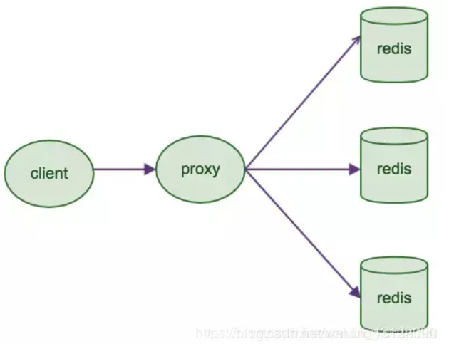

# Redis

## 面试题

### 概念

#### 优缺点

> 优点
>
> - **读写性能优异**， Redis能读的速度是110000次/s，写的速度是81000次/s。
> - **支持数据持久化**，支持AOF和RDB两种持久化方式。
> - **支持事务**，Redis的所有操作都是原子性的，同时Redis还支持对几个操作合并后的原子性执行。
> - 数据结构丰富，除了支持string类型的value外还支持hash、set、zset、list等数据结构。
> - **支持主从复制**，主机会自动将数据同步到从机，可以进行读写分离。
>
> 缺点
>
> - 数据库容量**受到物理内存的限制**，不能用作海量数据的高性能读写，因此Redis适合的场景主要局限在较小数据量的高性能操作和运算上。
> - Redis 不具备自动容错和恢复功能，主机从机的宕机都会导致前端部分读写请求失败，需要等待机器重启或者手动切换前端的IP才能恢复。
> - 主机宕机，宕机前有部分数据未能及时同步到从机，切换IP后还会引入数据不一致的问题，降低了系统的可用性。
> - Redis **较难支持在线扩容**，在集群容量达到上限时在线扩容会变得很复杂。为避免这一问题，运维人员在系统上线时必须确保有足够的空间，这对资源造成了很大的浪费。

#### Redis为什么这么快

- 完全**基于内存**，绝大部分请求是纯粹的内存操作，非常快速。数据存在内存中，类似于 HashMap，HashMap 的优势就是查找和操作的时间复杂度都是O(1)；
- **数据结构简单**，对数据操作也简单，Redis 中的数据结构是专门进行设计的；
- 采用**单线程**，避免了不必要的上下文切换和竞争条件，也不存在多进程或者多线程导致的切换而消耗 CPU，不用去考虑各种锁的问题，不存在加锁释放锁操作，没有因为可能出现死锁而导致的性能消耗；
- 使用**多路 I/O 复用模型**，非阻塞 IO；
- 使用底层模型不同，它们之间底层实现方式以及与客户端之间通信的应用协议不一样，Redis 直接自己构建了 VM 机制 ，因为一般的系统调用系统函数的话，会浪费一定的时间去移动和请求；

#### 数据类型

Redis主要有5种数据类型 包括String、List、Set、Zset、Hash满足大部分的使用要求

### 持久化

Redis 提供两种持久化机制 RDB（默认） 和 AOF 机制
推荐两种持久化方式同时使用

#### RDB

> RDB是Redis默认的持久化方式
> 按照一定的时间将内存的数据以快照的形式保存到硬盘中 dump.rdb
>
> 优点很多
>
> - 只有一个文件 dump.rdb 方便持久化
>
> - 容灾性好 一个文件可以保存到安全的磁盘
>
> - 性能最大化，fork 子进程来完成写操作，让主进程继续处理命令，所以是 IO 最大化。
>   使用单独子进程来进行持久化，主进程不会进行任何 IO 操作，保证了 redis 的高性能
>
> - 相对于数据集大时，比 AOF 的启动效率更高
>
> 但是缺点很明显 因为是隔一段时间保存 所以可能发生数据丢失

#### AOF

> 是将Redis执行的写命令都记录到单独的日志文件中
> 当重启Redis会重新将持久化的日志中文件恢复数据
>
> 当两种方式同时开启时 数据恢复Redis会优先选择AOF恢复
>
> 优点
>
> - 数据安全，aof 持久化可以配置 appendfsync 属性，有 always，每进行一次 命令操作就记录到 aof 文件中一次。
> - 通过 append 模式写文件，即使中途服务器宕机，可以通过 redis-check-aof 工具解决数据一致性问题。
> - AOF 机制的 rewrite 模式。AOF 文件没被 rewrite 之前（文件过大时会对命令 进行合并重写），可以删除其中的某些命令（比如误操作的 flushall）)
>
> 缺点：
>
> - AOF 文件比 RDB 文件大，且恢复速度慢。
>
> - 数据集大的时候，比 rdb 启动效率低。

#### 过期策略

> - 定时过期：每个设置过期时间的key都需要创建一个定时器，到过期时间就会立即清除。
>   该策略可以立即清除过期的数据，对内存很友好；
>   但是会占用大量的CPU资源去处理过期的数据，从而影响缓存的响应时间和吞吐量。
> - 惰性过期：只有当访问一个key时，才会判断该key是否已过期，过期则清除。
>   该策略可以最大化地节省CPU资源，却对内存非常不友好。
>   极端情况可能出现大量的过期key没有再次被访问，从而不会被清除，占用大量内存。
> - 定期过期：每隔一定的时间，会扫描一定数量的数据库的expires字典中一定数量的key，并清除其中已过期的key。该策略是前两者的一个折中方案。通过调整定时扫描的时间间隔和每次扫描的限定耗时，可以在不同情况下使得CPU和内存资源达到最优的平衡效果。 (expires字典会保存所有设置了过期时间的key的过期时间数据，其中，key是指向键空间中的某个键的指针，value是该键的毫秒精度的UNIX时间戳表示的过期时间。键空间是指该Redis集群中保存的所有键。)

#### 淘汰策略

> 选择键移除
>
> - 内存不足时 新写入操作会报错
> - 内存不足时 移除最近最少使用的key （最常用）
> - 内存不足时 随机移除某个key
>
> 过期时间移除
>
> - 内存不足时 在使用了过期时间的键中移除最近最少使用的key
> - 内存不足时 在使用了过期时间的键中随机移除某个key
> - 内存不足时 有更早过期时间的key优先移除

### 事务

#### 概念

> Redis 事务的本质是通过MULTI、EXEC、WATCH等一组命令的集合
> 在事务执行过程中 会按照顺序串行化执行队列中的命令
> 其他客户端提交的命令请求不会插入到事务执行命令序列中

总结说：redis事务就是一次性、顺序性、排他性的执行一个队列中的一系列命令

**redis不支持回滚  因为是单线程所以自带隔离性**
如果在一个事务中的命令出现错误 那么所有的命令都不会执行
如果在一个事务中出现运行错误 那么正确的命令会被执行

### 集群

#### 主从模式

> 主从模式下 redis有一个主服务器多个从服务器
> 主服务器挂掉的情况下 只能通过手动切换到从服务器
>
> 延迟复制：通过RDB文件实现主从同步复制（由从服务器发起请求）
> RDB文件同步后的写同步 是由主服务器发起的

#### 哨兵模式

> 哨兵模式相当于一个增强版的主从模式
> 上面提到的主从模式无法自动进行主从切换
>
> 原理：哨兵进程会定时向所有服务器发送ping命令 来判断服务是否正常
> 如果主服务器没有有效回复ping命令 则会被标注为主观下线
> 其他的哨兵进程也会向主服务器发送ping命令 如果足够多的哨兵认为是下线 则会变成客观下线
>

#### 集群模式

> 主从模式和哨兵模式 就像是一个脑子复制成多份使用
> 集群模式则像是一个脑子分成多分 每份进行复制使用
> 整个redis集群组成一个 最关键的问题就是数据存储的问题
>
> redis通过hash的方式将数据进行分片 每个节点存储一定哈希槽区间的数据（默认16384 个槽位）
> 每个数据分片内又是主从关系的多节点 数据写入先写主节点 再同步到从节点
> 读取数据时 目标key没有分配在当前节点上时 redis会返回转向指令 指向正确的节点
> 扩容时时需要需要把旧节点的数据迁移一部分到新节点
>
> 优点：无中心架构 支持动态扩容 对业务透明
> 客户端不需要连接集群所有节点 连接集群中任何一个可用节点即可
> 高性能 客户端直连redis服务 免去了proxy代理的损耗
>
> 缺点：数据迁移需要人工干预
> 只能使用0号数据库
> 不支持批量操作(pipeline管道操作)

#### 基于代理分片

> 透明接入 业务程序不用关心后端Redis实例 切换成本低
> Proxy 的逻辑和存储的逻辑是隔离的
> 代理层多了一次转发 性能有所损耗
>
> 成熟方案：
> Twtter开源的Twemproxy
> 豌豆荚开源的Codis
>
> 

#### 分区实现方案

> - 客户端分区：由客户端决定取那个分区
> - 代理分区：由代理决定
> - 查询路由：随便查询一个实例 由redis重定向到正确的分区

### 分布式

#### 分布式锁

> 使用 SETNX 命令实现分布式锁 
> 不过如果锁持有者 没有释放 则会造成死锁

#### Redlock

> redis官方提供的分布式锁
>
> 1. 安全特性：互斥访问，即永远只有一个 client 能拿到锁
> 2. 避免死锁：最终 client 都可能拿到锁，不会出现死锁的情况，即使原本锁住某资源的 client crash 了或者出现了网络分区
> 3. 容错性：只要大部分 Redis 节点存活就可以正常提供服务

### 缓存异常

#### 缓存穿透

> 绕过redis直接请求数据库（比如redis数据库都没数据 也就可以直接请求到数据库）
>
> 解决方案：数据库也没数据的话 可以把value写null放入缓存（过期时间设短点就行）
> 接口层增加校验

#### 缓存雪崩

> 大量的缓存在同一时间点失效  数据请求直接作用于数据库本身了 数据库挂掉
>
> 解决方案：在批量往Redis存数据的时候  把每个Key的失效时间都加个随机值就好了  这样可以保证数据不会在同一时间大面积失效
> 或者设置热点数据永远不过期  有更新操作就更新缓存就好了

#### 缓存击穿

> 一个承受高并发的缓存过期了 作用于这个热点数据上的访问都会直接作用于数据库 库很可能就会被瞬间击穿
>
> 解决方案：设置热点数据永远不过期
> 或者对热点数据 加上互斥锁 过期了等数据库去查 排队等

#### 缓存预热

> 系统上线后 缓存数据直接加载到缓存系统
>
> 解决方案：手工操作
> 或者如果是固定的数据 可以写在项目启动过程中自动加载

### 其他

#### 如何保证缓存与数据库双写时的数据一致性？

> 读请求和写请求串行化 串到一个内存队列里去 这样就可以保证一定不会出现不一致的情况
> 串行化之后 就会导致系统的吞吐量会大幅度的降低

#### Redis常见性能问题和解决方案？

> - Master最好不要做任何持久化工作
>   如果数据比较关键 某个Slave开启AOF备份数据 策略为每秒同步一次
> - 为了主从复制的速度和连接的稳定性 Slave和Master最好在同一个局域网内
> - 为了Master的稳定性 尽量使用单向链表结构

